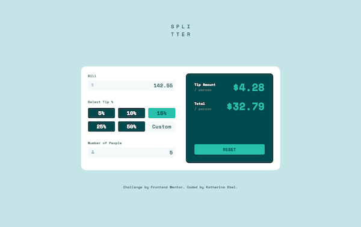
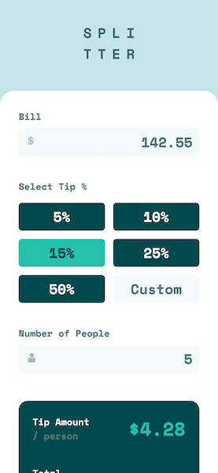

# Frontend Mentor - Tip calculator app solution

This is a solution to the [Tip calculator app challenge on Frontend Mentor](https://www.frontendmentor.io/challenges/tip-calculator-app-ugJNGbJUX). Frontend Mentor challenges help you improve your coding skills by building realistic projects.

## Table of contents

- [Overview](#overview)
  - [The challenge](#the-challenge)
  - [Screenshots](#screenshots)
    - [Desktop](#desktop)
    - [Mobile](#mobile)
  - [Links](#links)
  - [Built with](#built-with)
  - [Continued development](#continued-development)
- [Author](#author)

**Note: Delete this note and update the table of contents based on what sections you keep.**

## Overview

### The challenge

Users should be able to:

- View the optimal layout for the app depending on their device's screen size
- See hover states for all interactive elements on the page
- Calculate the correct tip and total cost of the bill per person

### Screenshots  

#### Desktop  

#### Mobile

### Links

- Solution URL: [Github repo](https://github.com/KatherineEbel/fem-tip-calculator-solution)
- Live Site URL: [Deployed on Vercel](https://fem-tip-calculator-solution.vercel.app/)

### Built with

- Semantic HTML5 markup
- Tailwind CSS
- Flexbox
- CSS Grid
- Mobile-first workflow
- React Context Api
- [React Testing Library](https://testing-library.com/)
- [Jest](https://jestjs.io/)
- [Next.js](https://nextjs.org/) - React framework
- [tailwindcss](https://tailwindcss.com/) - For styles

## Continued Development  

I'm sure I have missed some bugs, let me know if you find any.🙃

## Author

- Frontend Mentor - [@KatherineEbel](https://www.frontendmentor.io/profile/KatherineEbel)
- Twitter - [@Kathy_Ebel](https://www.twitter.com/Kathy_Ebel)
